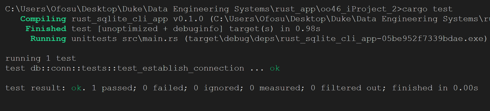
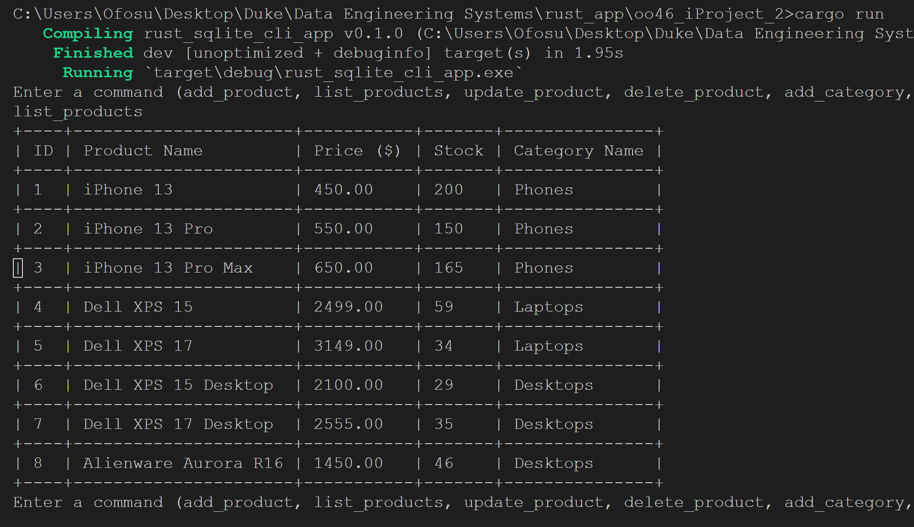

[][def]

# CLI Lab - Individual Project 2

## Project Scope

### Objective:

This project aims to develop a mini inventory management system that efficiently tracks products and their corresponding categories.

### Features & Functionalities:

1. Product Management:

- Addition: Users can add new products, specifying details such as name, price, stock count, and associated category.
- Listing: Display a list of all products with their details in a tabulated manner. Users can also view the products based on specific categories.
- Update: Modify the details of an existing product. This includes updating the name, price, stock, and category.
- Deletion: Remove a product from the inventory.

2. Category Management:

- Addition: Users can create new categories to classify products.
- Listing: Display all existing categories in the system.
- Unique Category Names: Ensure that each category has a unique name, avoiding any duplication or confusion.

3. Database Interaction:

- SQLite Backend: The system uses SQLite as its backend database, offering robust data storage and easy retrieval functionalities.
- Data Integrity: Utilize primary keys and unique constraints to maintain data integrity and avoid redundancies.
- Initialization: Automatic table creation if they don't already exist, ensuring a smooth user experience.

4. User Interface:

- Command Line Interface (CLI): A simple yet effective command-line interface that allows users to perform all functionalities by entering specific commands.
- Data Display: Represent data in a neat tabular format for easy readability.

## Github Copilot

GitHub Copilot was utilized efficiently in this project because of these practices:

- segmenting my code into smaller functions.
- commenting and usage of docstrings.
- Use of meaningful names for function parameters.

## Project deliverables:

### Structure

### How it all works together:

1. main.rs is responsible for initializing the application. It'll call the necessary functions to establish a connection to the database, set up tables, and initialize the CLI for user input.

2. models are the core data structures of the application. They define what a Product and Category look like.

3. db is where all the database interaction happens. If you need to query the database or modify it in any way, the functions here will handle that.

4. cli is the user interface. When you type commands, this module processes the input and calls the relevant functions from the db module.

This structure allows for a clear separation of concerns. Each module is responsible for its domain, making it easier to debug, modify, or expand the application in the future.

## CLI Commands Usage for Mini Inventory System

1. Initialization: When you run the program, it initializes the SQLite database and tables if they don't already exist. You'll then be presented with a prompt to enter commands.
2. Product Management: Commands

- add_product -> Follow the interactive prompts to enter product name, price, stock, and category.
- list_products -> Displays all products in the inventory in a tabulated format.
- update_product -> You'll need to specify the product ID you want to update. Then, follow the prompts to update name, price, stock, or category.
- delete_product -> Enter the product ID of the item you want to remove from the inventory.

3. Category Management: Commands

- add_category -> Follow the interactive prompts to enter a unique category name.
- list_categories -> displays all categories currently in the system.

4. Exiting the Application: Command

- exit -> To safely exit the CLI and close the SQLite connection

5. General Tips:
   The CLI is case-sensitive; ensure you're entering commands exactly as mentioned.
   For any action that requires referencing an existing item (like updating or deleting a product), ensure you have the correct ID. Using the list_products command can help verify this.

### Testing Output:

### Application Output:

### Youtube Link

[Click here](https://youtu.be/Ylxs6TdKvfE)

[def]: https://github.com/nogibjj/oo46_Mini_Proj_W8/actions/workflows/cicd.yml
